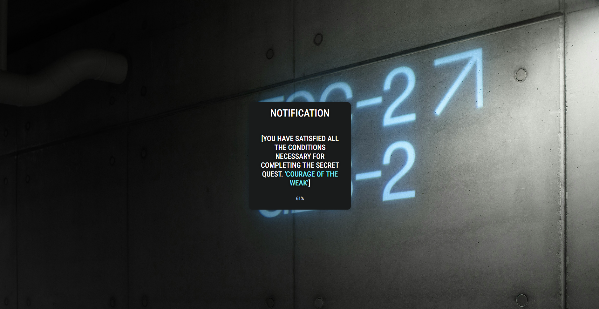

# Solo-Leveling With Nextjs 

> Imagine you are being summoned to this world as a player with system support to allow you to level up and power up. As you grow by defeating enemies, you receive extraordinary rewards and player stats update. This is a tale for any commoner to rise to become the world strongest!

A fan-made NextJS project to showcase the leveling system notification in Solo-Leveling manhwa using framer motion. The notification system might not look like what we see in the manhwa due to lack of design resources. 



## Getting Started 🔥

First, run the development server:

```bash
npm run dev
# or
yarn dev
# or
pnpm dev
# or
bun dev
```

Open [http://localhost:3000](http://localhost:3000) with your browser to see the result.

You can start editing the page by modifying `app/page.tsx`. The page auto-updates as you edit the file.

This project uses [`next/font`](https://nextjs.org/docs/basic-features/font-optimization) to automatically optimize and load Inter, a custom Google Font

## Some Ideas 🧠

- Player stat showcase 
  - Uses a random function to determine players classes (from F rank to S rank)
- Player personal currency store
  - Allows user to use point to purchase items (can be mythic, legendary grade)